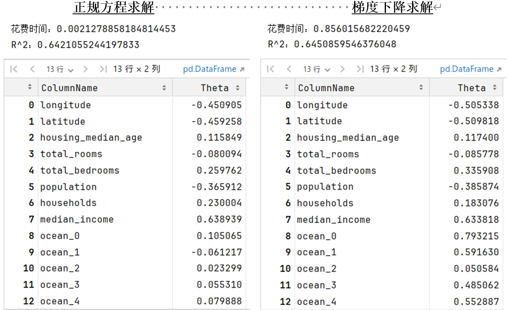
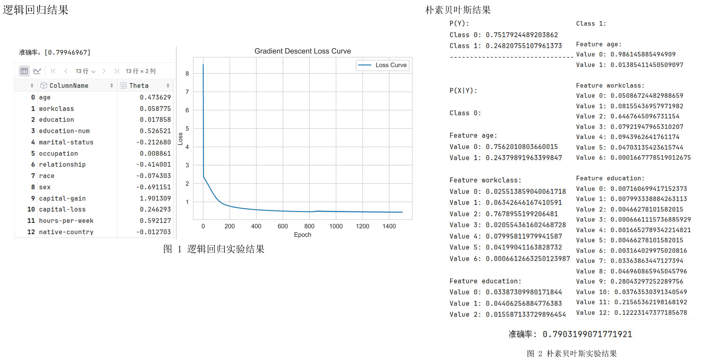
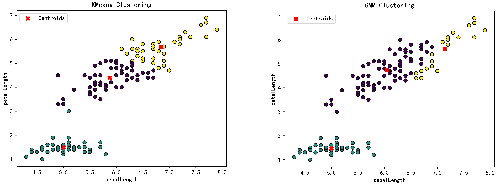

# Machine-Learning-Labs

## 项目介绍

本项目包含机器学习课程中的实验内容，主要包括线性回归、逻辑回归与朴素贝叶斯分类、以及聚类分析等算法的实现与应用。

## 项目结构

- `chapter-1/linear-regression/`: 线性回归实验

- `chapter-2/logistic-regression-naive-bayes/`: 逻辑回归与朴素贝叶斯分类实验

- `chapter-3/clustering/`: 聚类分析实验

## 实验工具

实验用到的开发工具与框架：

- **Python**：建议使用 Python 编程语言进行算法的实现。
- **NumPy** 和 **Pandas**：用于数据处理与分析的常用库。
- **Matplotlib** 和 **Seaborn**：用于可视化实验结果，展示数据特征与模型表现。
- **Scikit-learn**：提供了多种机器学习算法的库，可以用来对比自定义实现与库中实现的效果。

## 许可证

本项目仅供学习和参考，禁止未经授权的商业用途或抄袭。
